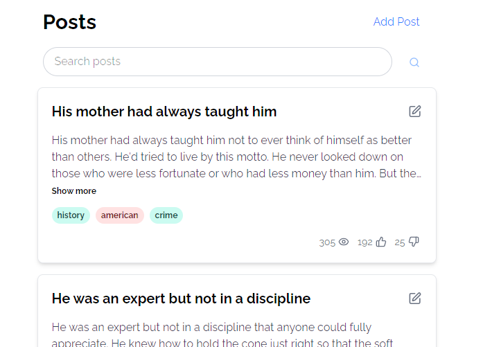

# Hococo Coding Challenge – Posts Exercise

This repository contains my solution to the Hococo Post coding challenge.

## About the Challenge

This exercise was provided by Hococo to demonstrate proficiency with relevant technologies, problem-solving skills, and attention to detail. The challenge involves building a posts list application based on a Figma design.

## The Exercise



I was provided this
[**Figma Design Link**](https://www.figma.com/design/ynXV5sipW3kKhCnoRBFtOu/front-end-task-posts?t=QsYkOxdVS9Giw8hJ-1)

**Main Feature added:**

- Displayed a list of posts, paginated into chunks of 20.
- Displayed the next chunk of posts when the user scrolls down far enough (infinite scrolling).
- Provided functionality to add a post. This added post should appear in the list.
- Provided functionality to edit posts. The changes should be reflected in the list.

**Optional features added:**

- Provided functionality to delete posts. 
- Provided functionality to search posts.
- Displayed other attributes of each post, (tags, views, and reactions).
- Add error handling in case the API throws an error (console error handling).

## Tools Used

- React (with Vite)
- Tailwind CSS for the styling

## How i proceded

### 🎨The UI
The first part of the assignment was pretty straightforward, meaning I just had to create a simple UI resembling the Figma file I was provided, trying to figure out all the missing interactions and behaviours related to the function I had to add. I tried to be as consistent as possible, keeping the style simple and not too fancy. The main focus still remains on the post content, even when adding minor additional information like views and reactions, using icons instead of redundant or excessive text.

One thing that definitely stands out are the tag pills. I wanted to break the layout a bit, giving a subtle emphasis to the tags. Initially, the idea was to assign a colour code to each tag, so that whenever a user added a tag that already existed, the correct colour would be applied automatically, avoiding a default grey pill. However, since there were many tags, this would have taken too long. So, as an MVP approach, I kept the colour assignment random.

I made sure the contrast remained high for readability across all elements, but played with opacity to create a visual hierarchy, helping the user intuitively understand the relative weight of the information in a post. Tags are highlighted so they can act as links or filters, allowing users to group posts by specific topics — another way of navigating the page. That said, this feature should probably be treated as a second-phase improvement.

I've also added a way to check if line clamping is active, so that a "show more" button can be displayed to reveal the full post, keeping things consistent with the Figma file and the overall app layout. As a small touch, I also introduced some UI elements to help users understand whether they’ve reached the end of the page or if there are no posts at all.

### 🎲The Logic
While building the UI, I tried to group all the API calls into a separate file, in order to keep them organised and easily reusable. I also wrapped them with some try/catch blocks to handle any unwanted responses.

One thing I'm still unsure about is whether to give proper relevance to CRUD functionalities for posts added locally as well. The tricky part of this exercise, at least for me, was not having a fully running database to work with. Since the API only returned simulated responses, I had to split the logic into two different paths. Locally added posts weren’t covered by the mock backend, so in order to keep the post list consistent, I used API calls where possible to get simulated responses and then manually updated the list — as if a fresh GET request had been made.

I have to admit, I didn’t tackle this challenge in the most efficient way. This kind of communication between components required lifting the state up to the main Home component, which made things more complex than they needed to be. In hindsight, I would have used a state management library like Redux Toolkit or even Zustand (which feels more lightweight and plain) to better structure a more compact and centralised state. However, at the time, I had already started with a lifting approach, and switching strategies late in the process didn’t feel ideal, especially considering the time constraints. I also wasn’t sure whether using external libraries was within the scope of the assignment, and I wanted to focus more on the thinking process rather than choosing the most "correct" tool for the framework.

The main issue that left me a bit stuck was deciding whether or not to apply the same functions — especially update — to posts added locally. Since these posts weren't actually stored in the API database (the POST call would return a mocked post with an ID, but nothing persisted), I had to find another solution to prevent errors and make the experience feel consistent. Logically, that also meant I would have needed to handle deletion in the same way.

The reason I got stuck there is simple: in a real-world scenario, this wouldn't happen. A real API would directly talk to the database, and none of these issues would have existed in the first place.

That said, for the sake of the exercise — and out of curiosity — I ended up adding the feature after my final commit. The core idea was to treat both sets of posts the same way, and just add a flag to the locally created ones to distinguish them. In fact, by adding a boolean isLocallyAdded property, I was able to conditionally switch logic, filter them out of actual API calls, and just rerender the UI accordingly, simulating even those calls.

It’s not a clean or ideal solution, more of a workaround to reach the goal of the exercise,but in this particular setup, it worked well enough.

Apart from that, I also reused an infinite scroll snippet I had written for a different project and adapted it to this app, which helped me implement the infinite scrolling feature smoothly.

### 💥Optional feature
Having the chance to already work with an API endpoint for the search feature helped speed up the process of adding a search bar. It’s not perfect and still needs improvement, but since I added it after the official time frame of the task, I just wanted to give it a try and see how far I could take it. I also included a small filter display for the searchQuery, so users can remember what their initial query was or simply reset the search if needed.

Even here, I ran into the same issue I mentioned earlier. Adding a post locally created a conflict with the search functionality, since the API response would only return data stored remotely in the database. So once again, I found a workaround — this time by caching locally added posts and conditionally appending them to the search results if they matched the query, either in the title or the body. I also made sure that deleted cached posts would be properly filtered out from that list, so the result stays clean and in sync.


### ❓What now?
As previously mentioned, something that would be necessary in a production phase is, without doubt, a code refactor. There are several parts that could be optimised or rewritten to make the logic clearer and more maintainable. The first thing I’d tackle is introducing a state manager or a custom context hook to avoid excessive state lifting. (It’s not overwhelming at the moment, but there’s definitely room for improvement.)

One other thing that surely would stand out, is the implementation of toast messages that help user with error handling. This is fastly achievable through specific and useful libraries (react-hot-toast for example).

Another important point would be accessibility. Using the ARIA ruleset properly would improve the overall user experience, especially for assistive technologies. But given the time constraints and the purpose of this task, that wasn’t the main focus.

For me personally, and in terms of the final goal of the assignment, I think it would also be useful to brush up on my Vue.js skills and try to rebuild the project using that framework. It would not only help me understand the key differences in logic compared to React, but also it would give me a more solid idea of Vue for day-to-day tasks in the office.

## How to Run

1. Clone the repository.
2. Install dependencies:

   ```bash
   npm install
   ```
3. Start the development server:
   ```bash
   npm run dev
   ```
4. Open your browser at `http://localhost:5173`.
